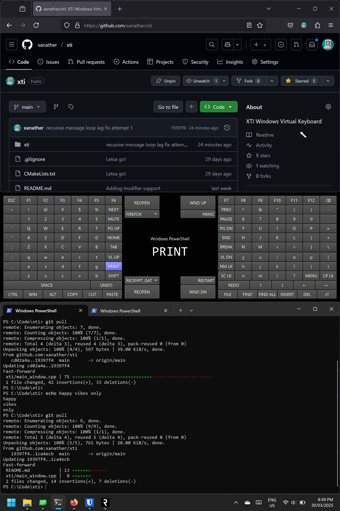

# XTI Windows Virtual Keyboard



The pre-existing Windows virtual touch keyboard is terrible for typing on for productivity.
+ Mainly designed for power users where all standard keyboard keys are available.
+ Has basic extensible JSON config.
+ Designed to work on with thumbs only in the middle of the tablet in portrait mode (like a big mobile phone).
+ Brings the cursor back by using virtual keyboard area as a touchpad simultaneously.

## Known limitations
- Don't change scaling or DPI of the system after starting.
- The program expects only one primary screen attached (the tablet screen). Adding more monitors after starting will screw things up.
- Must run as administrator otherwise Windows kernel will deny access to certain functions.
- It is not designed to work with a physical keyboard or other virtual keyboards. This program takes over control of the system for keyboard input.
- Requires D20 thumb dexterity.

## Building
Supports either x64 or Arm64 computers running Windows 11.
1. Install C++ Visual Studio feature (or Visual Studio C++ Build Tools).
2. Install Qt open source with MSVC desktop feature.
3. Install CMake.
4. TODO (does not exist yet): Run `build.ps1`.
5. Copy the set of .dll's and exe binaries in /release-output to where ever you want. Run the exe as admin. Creating an official installer and registering to start at startup as Admin might come later if I get time. I recommend configuring the exe to run with Windows Scheduler as admin at startup to begin with.

## Before Running
1. Create a config text file in user profile directory at ~/xti.json. See example-xti.json at root of repository for example usage.
   1. `displayName`: Text to show for dropdown in UI.
   2. `startExePath`: The executable or file to open if `checkExeName` and `checkTitleName` was not found.
   3. `startParams`: The parameters to pass to open if `checkExeName` and `checkTitleName` was not found. Leave empty if not needed.
   4. `startWorkingDir`: The working directory to use when opening.
   5. `checkExeName`: Used to determine if this entry is already running and brings it to the foreground.
   5. `checkTitleName`: Used to determine if this entry is already running and brings it to the foreground. The process specified in `checkExeName` must have at-least one window with `checkTitleName` text contained inside it. Leave empty for any title name.
2. Before running its recommended to make these changes:
   1. Bottom right of screen -> press battery/sound/wifi icon -> force rotation lock in portrait mode.
   2. Settings app -> time & language -> typing -> touch keyboard -> show the touch keyboard -> set as never.
   3. Disable 'tablet optimized' sizes of buttons and spacing: from elevated command prompt run the `reg add` command further below.
   4. (Optional): Settings app -> personalization -> taskbar -> system tray icons -> touch keyboard -> always show. Use this in emergency situation where you still need the old windows virtual keyboard.
```
reg add "HKLM\System\CurrentControlSet\Control\PriorityControl" /v ConvertibilityEnabled /t REG_DWORD /d 0
```

Restart computer after making above changes.

## Developing
This is a C++ CMake QT Creator project https://en.wikipedia.org/wiki/Qt_Creator. Simply open up the CMakeLists.txt file.
It is recommended to run QT Creator as admin so when debugging xti will also run as admin.

## Remaining TODO's
1. Don't create new thread each time for dispatching SendInput mouse events.
2. Virtual touchpad cursor goes behind some native Win32 contexts/windows.
3. General code cleanup/renaming and creating `build.ps1`.
4. Erroneous 'R' window icon showing on taskbar.

## License
GNU General Public License 3.0

```
This program is free software: you can redistribute it and/or modify
it under the terms of the GNU General Public License as published by
the Free Software Foundation, either version 3 of the License, or
(at your option) any later version.

This program is distributed in the hope that it will be useful,
but WITHOUT ANY WARRANTY; without even the implied warranty of
MERCHANTABILITY or FITNESS FOR A PARTICULAR PURPOSE.  See the
GNU General Public License for more details.

You should have received a copy of the GNU General Public License
along with this program.  If not, see <https://www.gnu.org/licenses/>.
```
